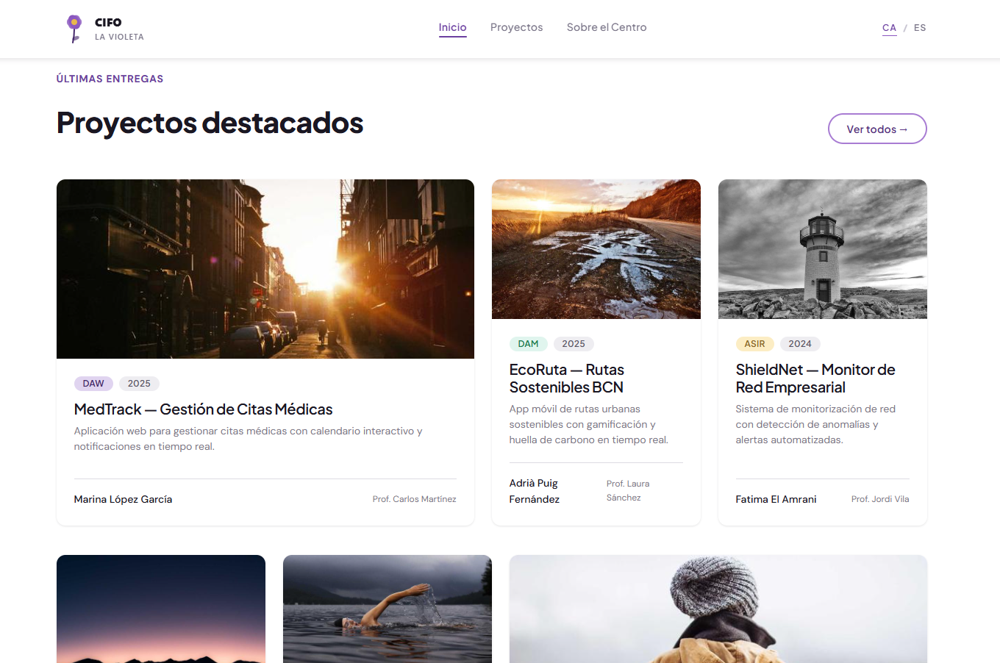
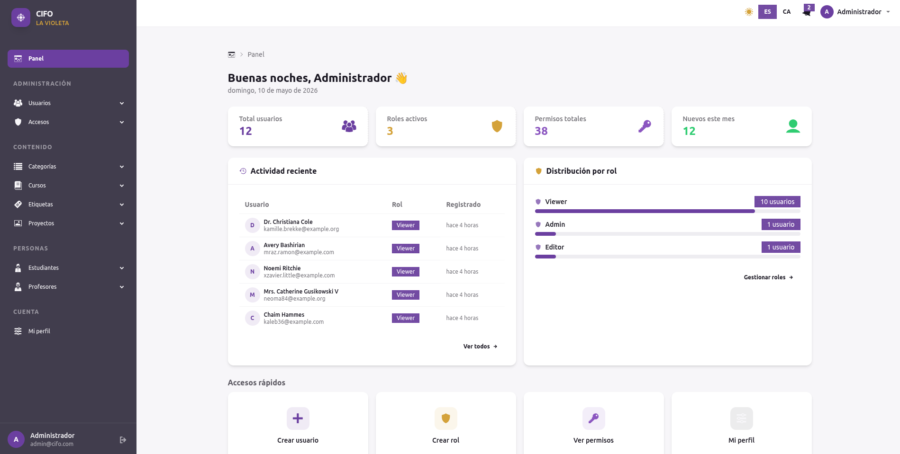
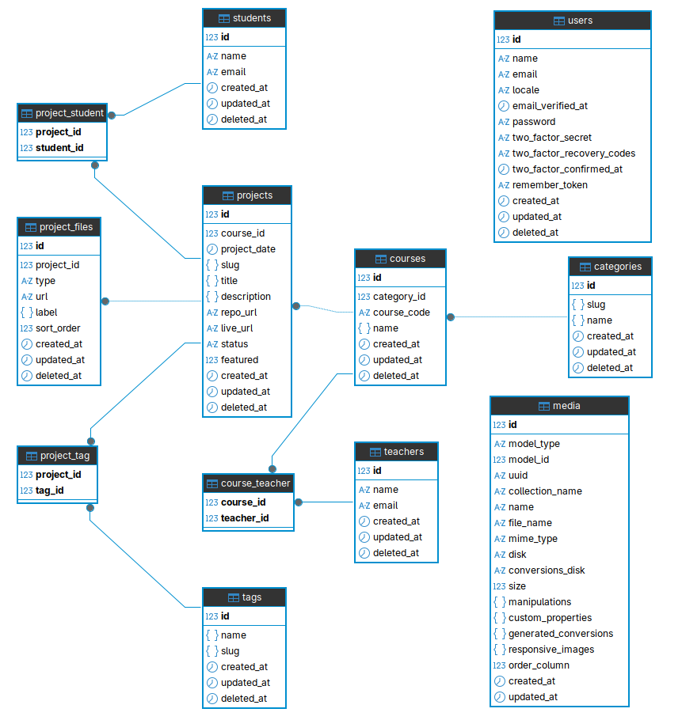
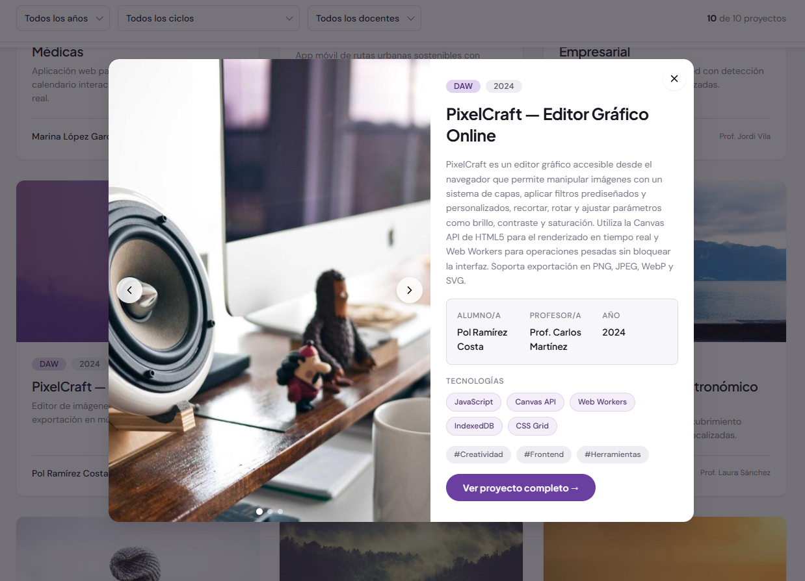
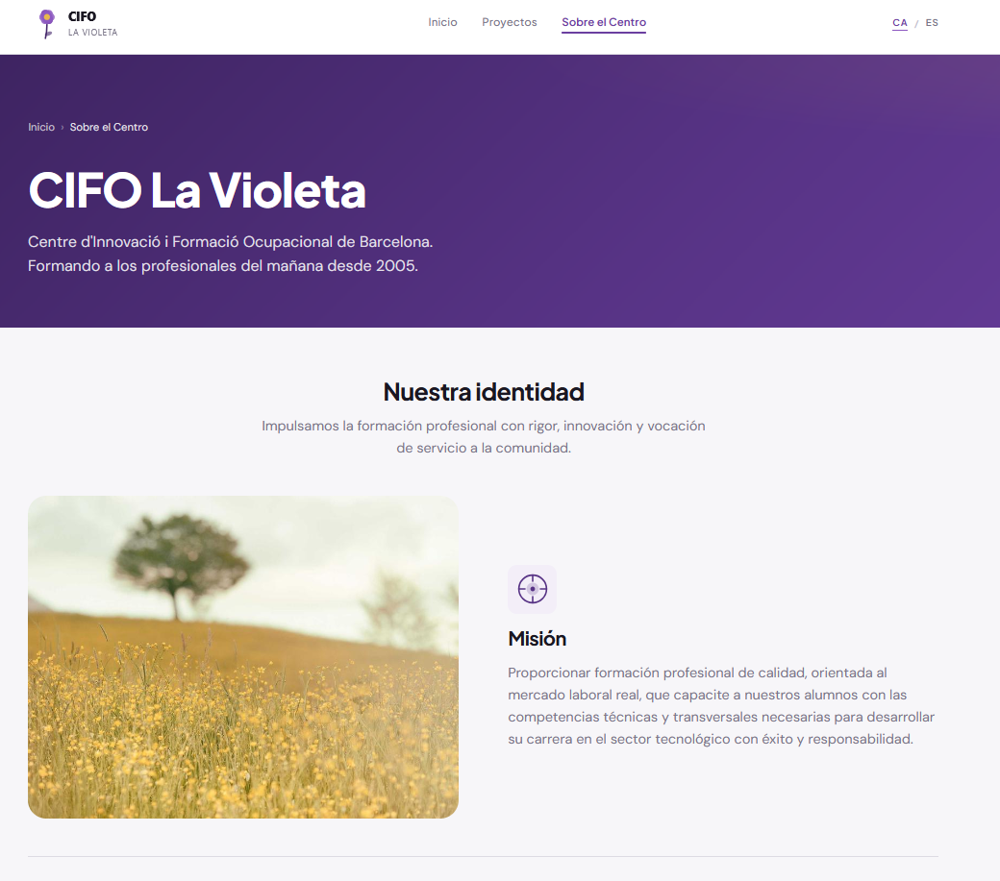
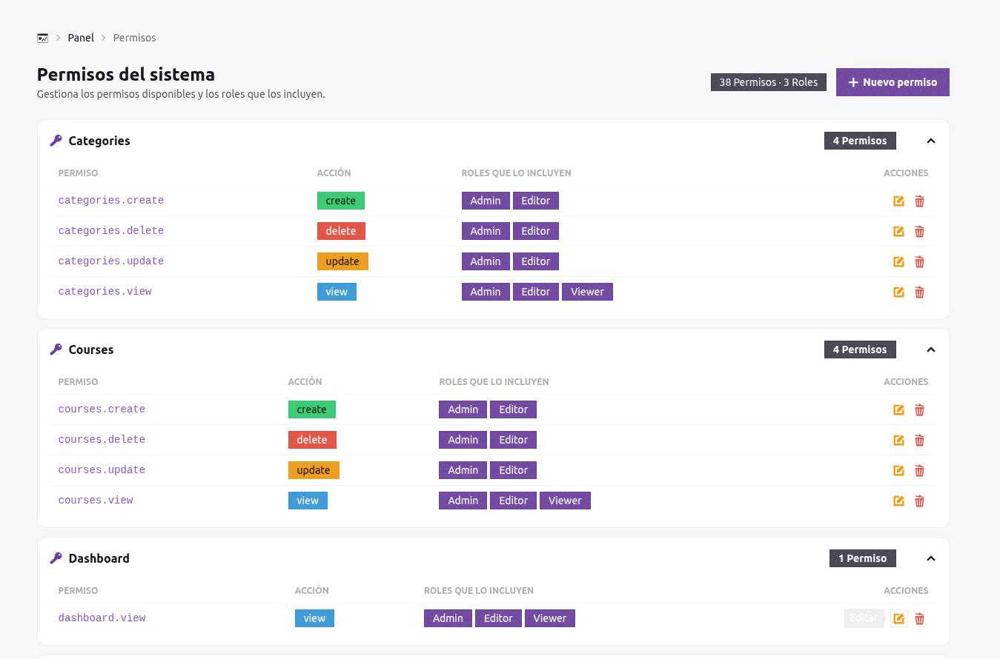
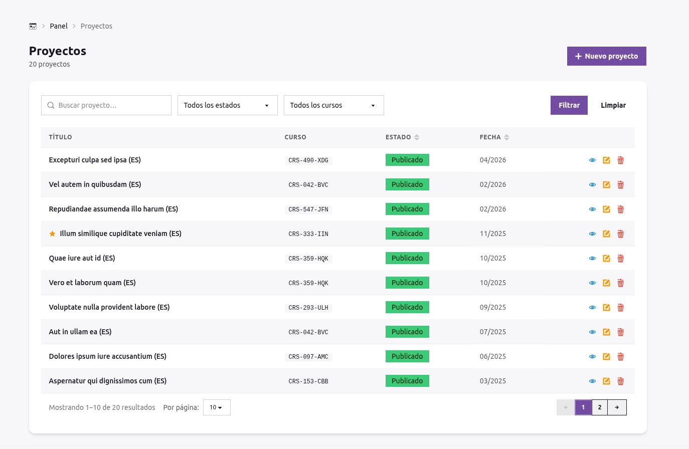

# 📒 SHOWCASE — Plataforma de Portafolios Institucionales

## Curs Confecció i Publicació de Pàgines Web 2026

### CIFO Barcelona La Violeta

---

## 🎯 Descripción

SHOWCASE es una plataforma web desarrollada para la gestión y publicación de proyectos académicos realizados por alumnos del CIFO.

<!--  -->

<p align="center">


</p>

La aplicación combina:

```text
✔ Portal público institucional
✔ Repositorio digital de proyectos
✔ Escaparate profesional para estudiantes
✔ WebApp administrativa de gestión de contenido
```

El objetivo principal es evitar la pérdida del patrimonio intelectual generado durante cada promoción académica, permitiendo conservar, organizar y publicar los trabajos finales realizados por los alumnos.

La plataforma busca conectar:

```text
formación + visibilidad profesional + empleabilidad
```

Además, proporciona al centro educativo un sistema centralizado para mantener un histórico digital e institucional de los proyectos desarrollados.

---

## 🧠 Objetivo del proyecto

Este proyecto tiene un enfoque académico y formativo, desarrollado como trabajo final del curso:

```text
Confecció i Publicació de Pàgines Web
```

Realizado en:

```text
CIFO Barcelona La Violeta
Barcelona - España
Dic 2025 → May 2026
```

El proyecto busca poner en práctica los conocimientos adquiridos durante el curso, integrando tecnologías modernas de desarrollo web y aplicando conceptos utilizados en aplicaciones reales.

---

## 🧩 Tecnologías utilizadas

```text
Frontend
```

- HTML5
- CSS3
- JavaScript
- TailwindCSS
- DaisyUI

```text
Backend
```

- PHP
- Laravel

```text
Base de datos
```

- MariaDB

---

## ✨ Funcionalidades principales

La plataforma incorpora funcionalidades tanto públicas como administrativas.

### 🌐 Portal público

- navegación multiidioma
- selector Catalán / Español
- detección automática del idioma del navegador
- listado de proyectos
- filtros y ordenamiento
- paginación
- modo día/noche
- diseño responsive
- sliders de imágenes
- modales y componentes UI modernos

---

### 🔐 WebApp administrativa

```text
✔ Registro de usuarios
✔ Login
✔ Confirmación vía correo electrónico
✔ Gestión de perfiles
✔ Roles y permisos
✔ CRUDs completos
✔ Dashboard administrativo
✔ Gestión dinámica de contenido
✔ Subida de imágenes
✔ Gestión de archivos asociados a proyectos
✔ Enlaces externos y documentación
```

---

## 🧠 Arquitectura del proyecto

La aplicación utiliza arquitectura:

```text
MVC (Model - View - Controller)
```

Aplicando principios de:

- separación de responsabilidades
- reutilización de componentes
- modularidad
- mantenimiento escalable
- organización por capas

---

## 🗂️ Estructura del proyecto

```text
.
├── app
│   ├── Actions
│   │   └── Fortify
│   ├── Enums
│   ├── Http
│   │   ├── Controllers
│   │   │   ├── Admin
│   │   │   └── Front
│   │   ├── Middleware
│   │   └── Requests
│   ├── Models
│   ├── Providers
│   └── View
│       └── Components
│           └── Admin
├── database
│   ├── factories
│   ├── migrations
│   └── seeders
├── lang
│   ├── ca
│   └── es
├── routes
└── storage
    ├── app
    ├── framework
    ├── logs
    └── media-library
```

---

## 🗃️ Base de datos

### Tablas principales

```text
categories
course_teacher
courses
media
project_files
project_student
project_tag
projects
students
tags
teachers
users
```

---

## 🔗 Relaciones de la base de datos

<!--  -->

<p align="center">

</p>

---

## ⚙️ Instalación

### 1. Preparar entorno

Descargar y descomprimir el proyecto.

Instalar:

- XAMPP (Apache + MySQL/MariaDB)
- PHP Composer
- NodeJS

---

### 2. Configurar variables de entorno

Crear archivo:

```text
.env
```

A partir de:

```text
.env.example
```

Configurar:

- conexión a base de datos
- parámetros del servidor Apache
- URL base de la aplicación

---

### 3. Generar dependencias y entorno Laravel

Ejecutar:

```bash
php artisan key:generate
composer update
php artisan migrate:fresh --seed
php artisan optimize:clear
php artisan storage:link
npm install
npm run build
```

---

### 4. Acceder a la aplicación

Abrir en navegador:

```text
Depende de server local XAMPP:
http://localhost/carpeta/plublic/es

Si tienen configurado un virtualhost Local:
http://cifoapp.test
```

---

## 🔐 Acceso por defecto

```text
Usuario: admin@cifo.com
Password: admin123
```

---

# 🧭 Flujo principal de la WebApp

## 🔄 Navegación administrativa

```text
LOGIN
   ↓
DASHBOARD
   ↓
MENÚ ADMINISTRATIVO
```

---

## 📂 Estructura funcional

```text
Administración
│
├── Usuarios
│   ├── Listado (CRUD)
│   └── Crear nuevo
│
├── Accesos
│   ├── Roles (CRUD)
│   └── Permisos (CRUD)
│
Contenido
│
├── Categorías
│   ├── Listado (CRUD)
│   └── Nuevo
│
├── Cursos
│   ├── Listado (CRUD)
│   └── Nuevo
│
├── Etiquetas
│   ├── Listado (CRUD)
│   └── Nuevo
│
├── Proyectos
│   ├── Listado (CRUD)
│   └── Nuevo
│
Personas
│
├── Estudiantes
│   ├── Listado (CRUD)
│   └── Nuevo
│
├── Profesores
│   ├── Listado (CRUD)
│   └── Nuevo
│
Cuenta
│
├── Mi perfil
│
└── Logout
```

---

# 🌐 Flujo del portal público

```text
Inicio
   ↓
Explorar proyectos
   ↓
Filtrar / Buscar
   ↓
Ver detalle del proyecto
   ↓
Consultar archivos e información relacionada al CIFO
```

---

## 🧩 Conceptos trabajados

- arquitectura MVC
- Laravel
- Eloquent ORM
- relaciones many-to-many
- internacionalización (i18n)
- autenticación y autorización
- middleware
- validaciones
- CRUD completo
- paginación
- filtros dinámicos
- componentes reutilizables
- responsive design
- gestión de archivos
- organización modular
- dashboards administrativos

---

## 🌍 Internacionalización

La aplicación incorpora soporte multiidioma:

```text
✔ Catalán
✔ Español
✔ estructura preparada para Inglés
```

Utilizando:

```text
/lang
```

Como sistema centralizado de traducciones.

---

## 📁 Gestión multimedia

La plataforma permite:

- subida de imágenes
- almacenamiento de archivos asociados a proyectos
- gestión de recursos multimedia
- enlaces externos
- documentación complementaria

---

## 🎨 Interfaz y experiencia de usuario

El frontend fue diseñado utilizando:

- TailwindCSS
- DaisyUI

Incorporando:

```text
✔ diseño responsive
✔ modo oscuro/claro
✔ componentes modernos
✔ navegación adaptable
✔ interfaz administrativa organizada
```

---

## 👥 Integrantes del proyecto

```text
Germán Contreras
Franco Calderón
```

---

## 👤 Asesor del Proyecto

```text
Profesor: Manel Plaza
```

---

## 🔗 Link del repositorio

[Repositorio GitHub](https://github.com/germansango01/cifo-showcase-app.git)

---

## 📸 Capturas del proyecto

<!-- 
 -->

### 🌈 FrontEnd

<p align="center">


</p>

### 🗄️ BackEnd

<p align="center">


</p>

---

## 🧠 Idea principal del proyecto

```text
SHOWCASE no es solamente una aplicación CRUD.

Es una plataforma diseñada para preservar,
organizar y visibilizar el trabajo académico
realizado por los estudiantes del CIFO.
```

---

## 🚀 Proyección

La plataforma fue desarrollada con una estructura preparada para evolucionar hacia un entorno real de producción, permitiendo futuras mejoras como:

- integración con APIs
- búsqueda avanzada
- perfiles públicos
- analíticas
- panel institucional
- sistema de publicación automatizado
- almacenamiento cloud
- métricas de empleabilidad

---
